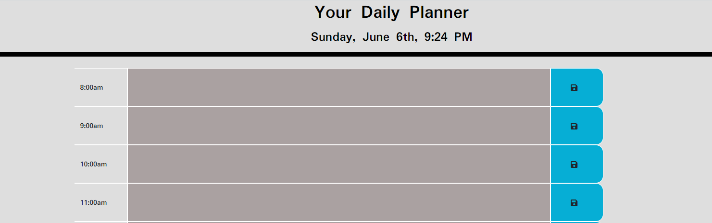
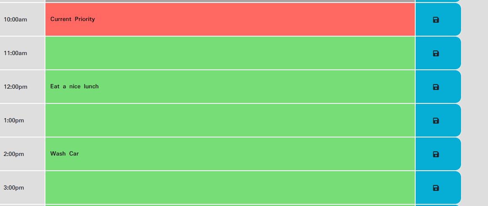

# Your Daily Planner

### User Experience:

1. User will be presented with individual time blocks reflecting standard business hours of 9:00am-5:00pm
    
    
   
    
     2. From here the user will be able to enter text denoting what they hope to accomplish. Hour blocks are timecoded, CSS styles will change depending on the hour block in relation to the current time. Future time blocks are green, present time blocks are orange, and past time blocks are grey.
    
    
   
    
     3. User will be able to save their tasks, and have them persist once the page reloads. Once the user clicks the save icon an object literal is updated and passed to local storage. Once the page reloads, this object literal will be pulled from local storage and populated onto the proper time blocks. User can remove tasks by deleting text and saving.
    
    

#### Deployed URL : https://lelandcypress.github.io/Daily-Planner/

 
Assets Used

- Written in: JQuerry an Bootstrap
- Time generated by Moment.js
- Font Used: Google Fonts Paduak
- Icons From: FontAwesome
